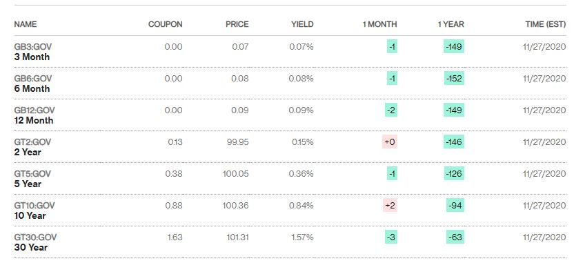

# bondpricing
Just a simple function to calculate the net present value of a bond given the biannual coupon payments, interest rates, price of the bond, and the number of years active

Given:


For the thirty year bond, assuming a steady 2.5% interest rate in the US,
```
What is the principal value of the bond? 101.31
What is the interest rate of the the country? 2.5
How much does the borrower give out biannually as a coupon as dollars 1.63
How many years is the bond active for? 30
```
returns:
```
The net present value of the bond is 116.5315552880858
The bond will return a total of 15.024731307951633% at maturity
The annualized compounded return of the bond is 0.4676801393924235% per year
```
